# Ecommerce BackEnd Site
  '

  ## Description

To build the **back end for an e-commerce site** by configuring a working Express.js API and using Sequelize to interact with a MySQL database.

  ## Table of Content 
- [Ecommerce BackEnd Site](#ecommerce-backend-site)
  - [Description](#description)
  - [Table of Content](#table-of-content)
  - [Installation](#installation)
  - [Usage](#usage)
  - [License](#license)
  - [Links](#links)
  - [Github](#github)
  
## Installation
Node js
Express.js
Dotenv
Sequelize
Mysql

## Usage 
To test out a successfully API route using Thundercloud by editting the route files. Once updated, Thundercloud will be able to view(GET), create(POST), update(PUT), and delete data in my database.

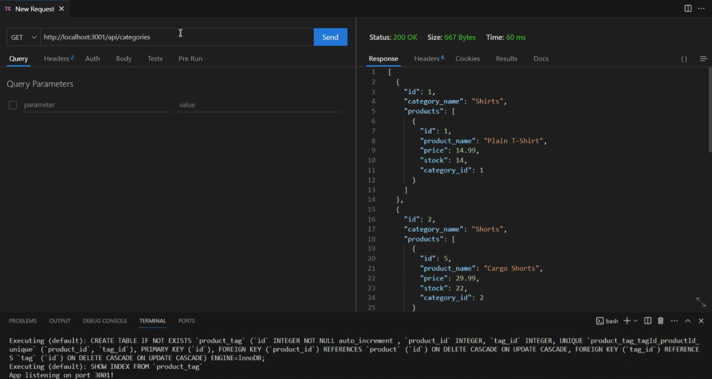

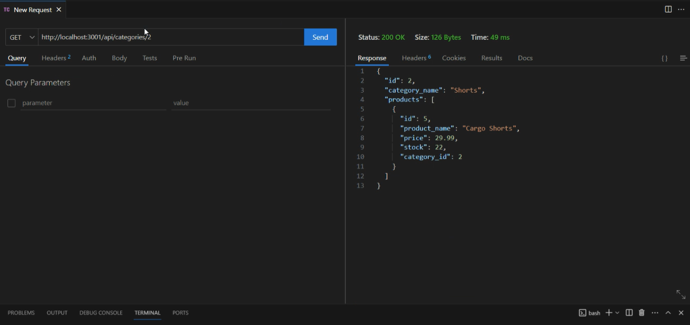

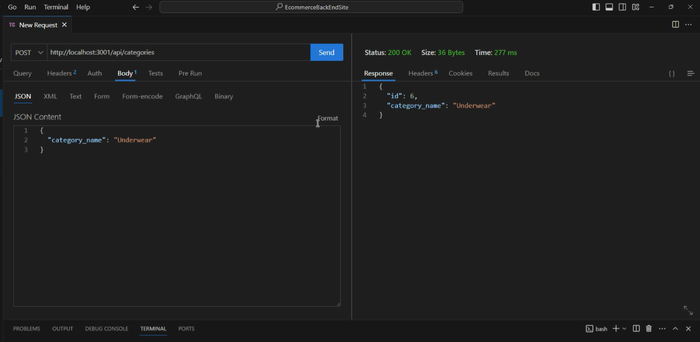

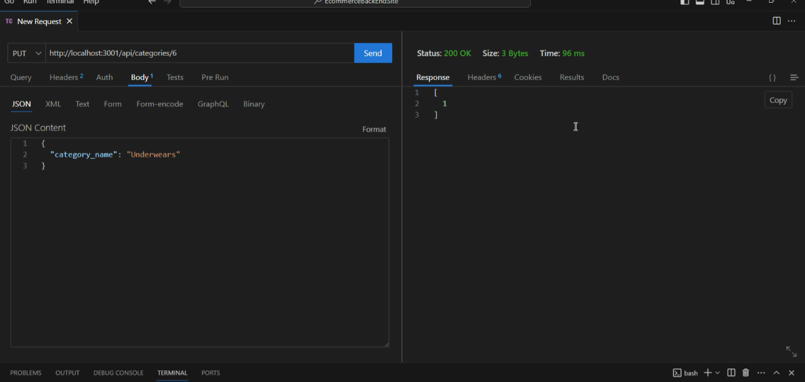

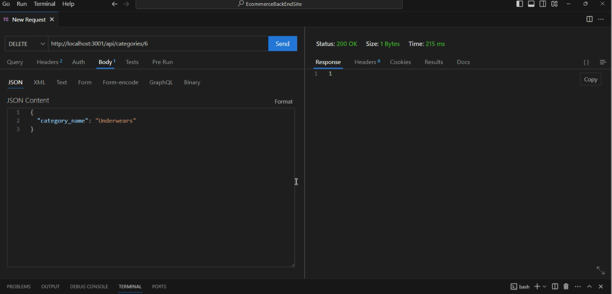

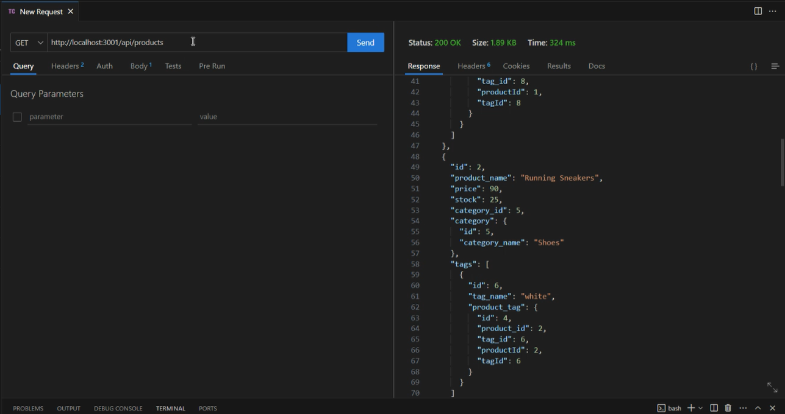

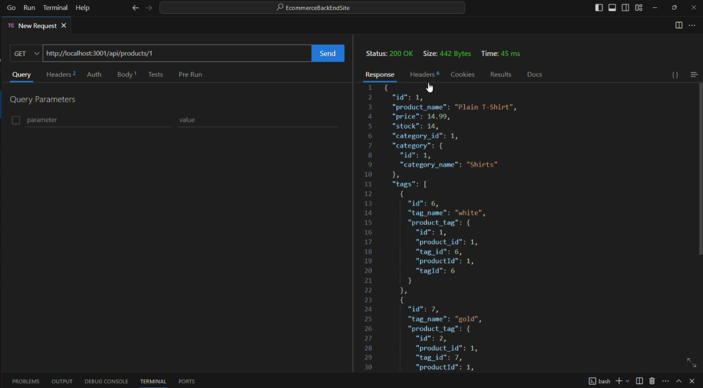

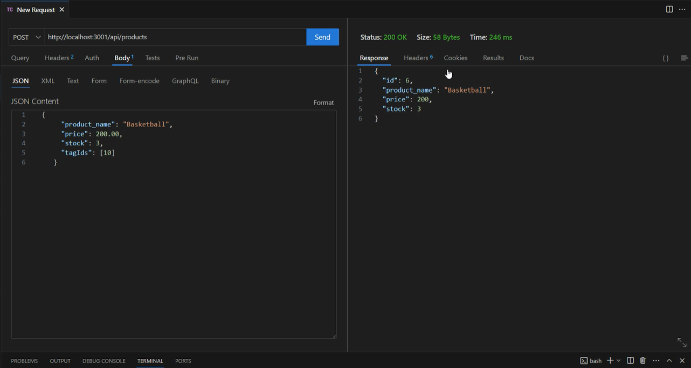

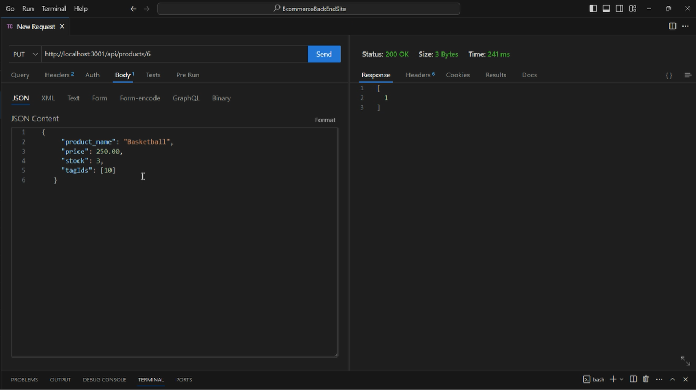

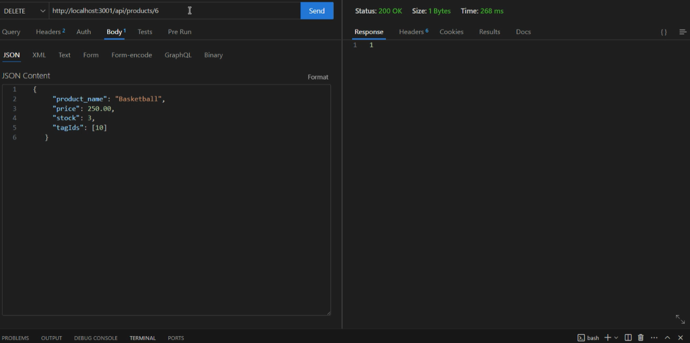

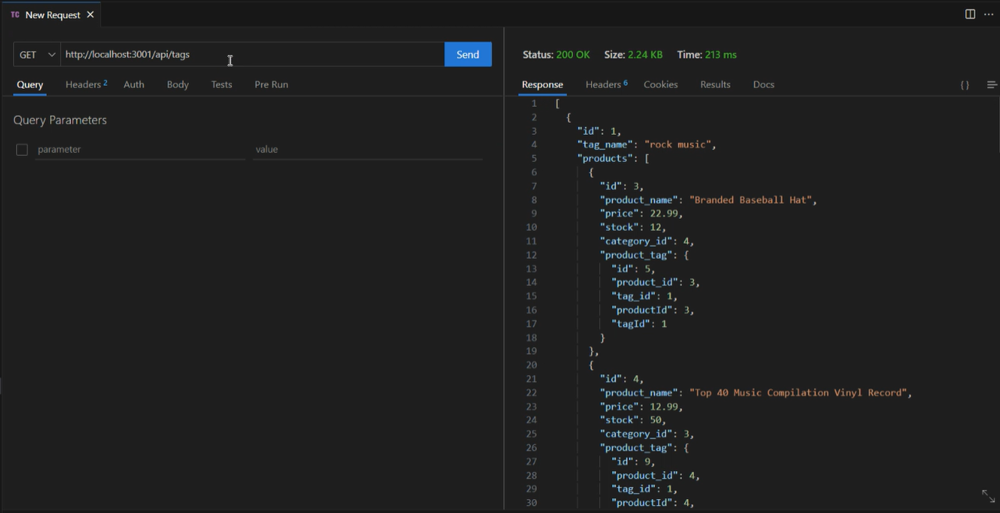

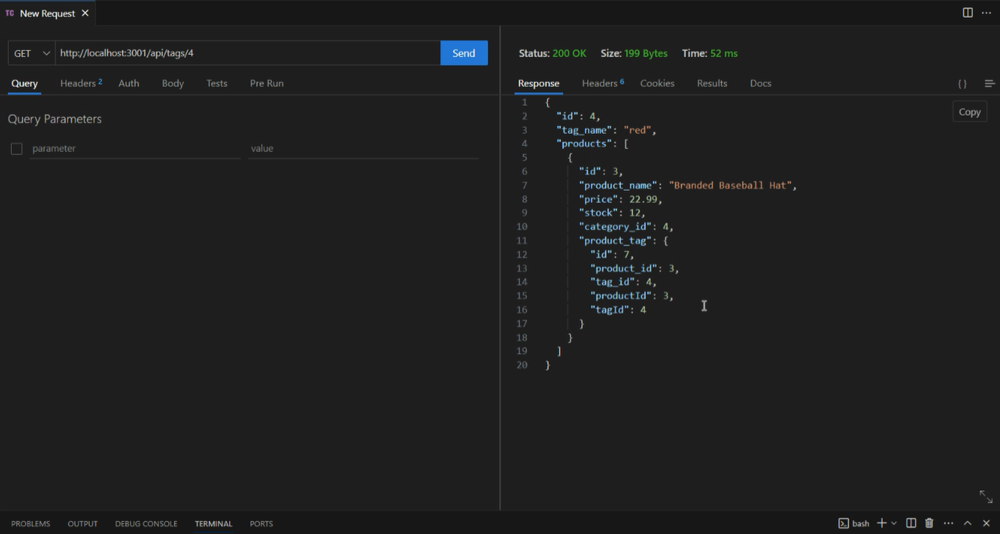

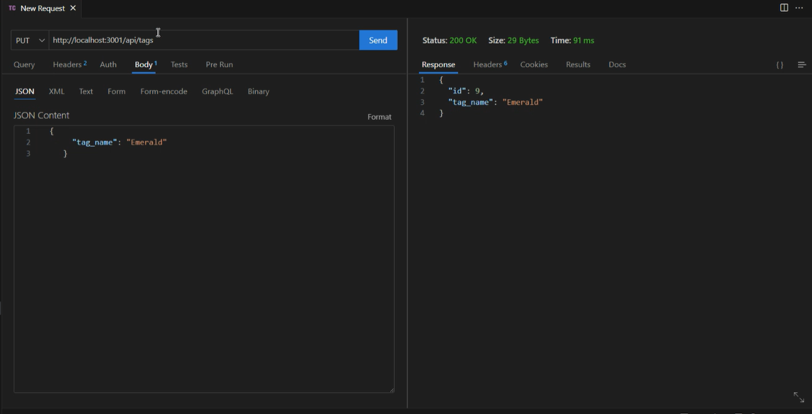

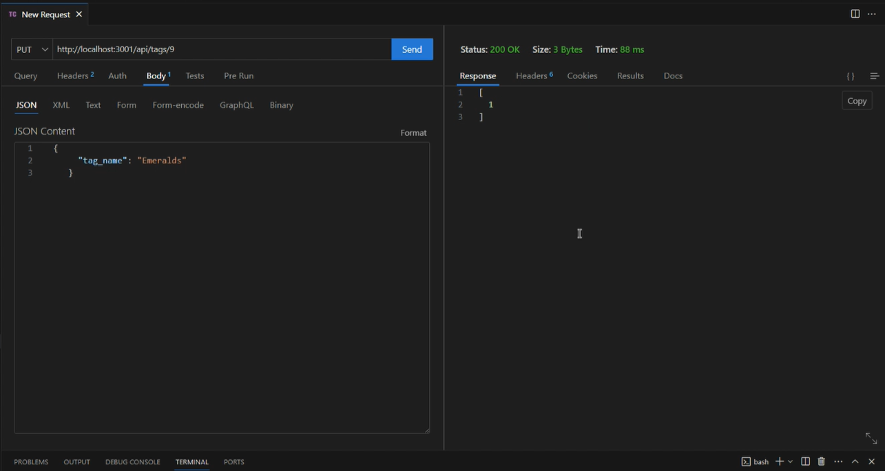

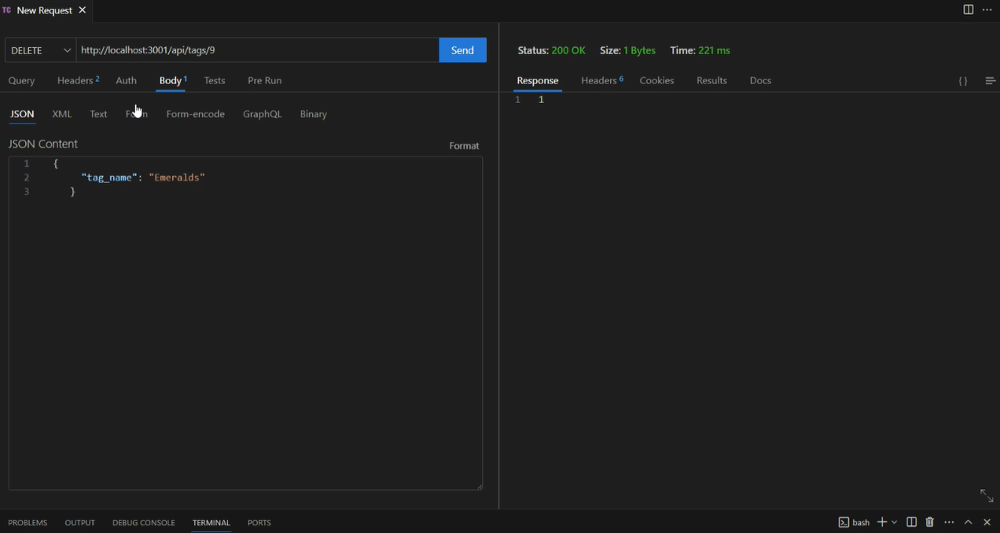

## License
  
Read about your license MIT

 ## Links 
GitHub page: https://github.com/KaiDoll/EcommerceBackEndSite 
Walkthrough video: https://drive.google.com/file/d/1VI-nWogbKl2kejWMz-Z3WwDGo2qAEGWX/view?usp=sharing   

 ## Github 
Username: KaiDoll